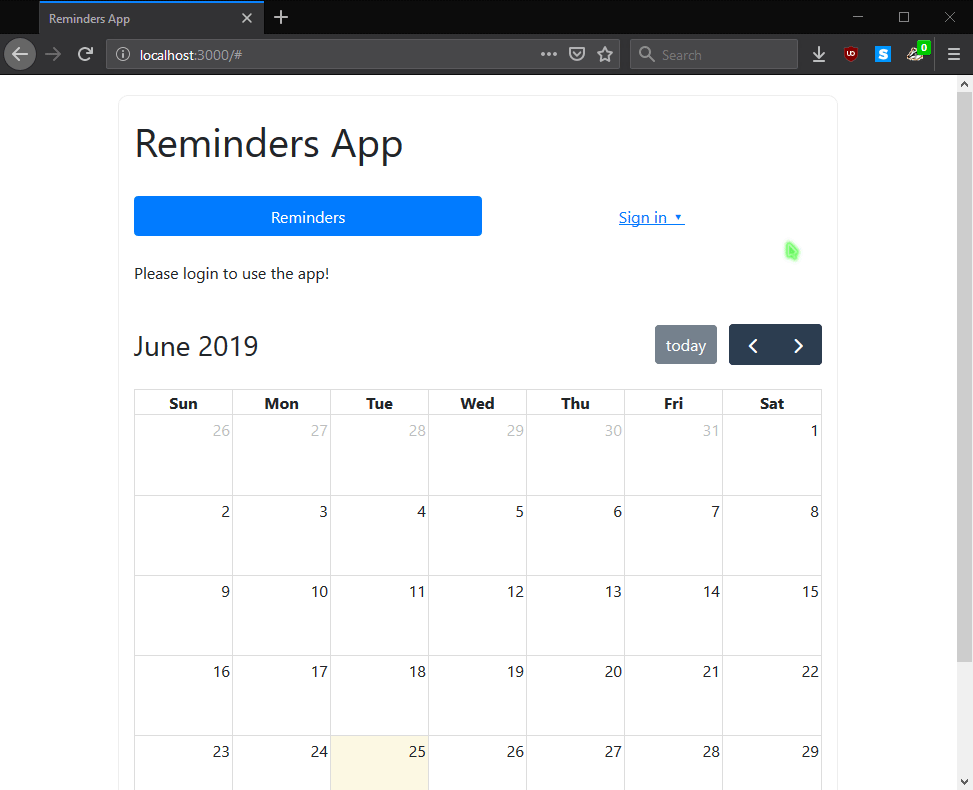
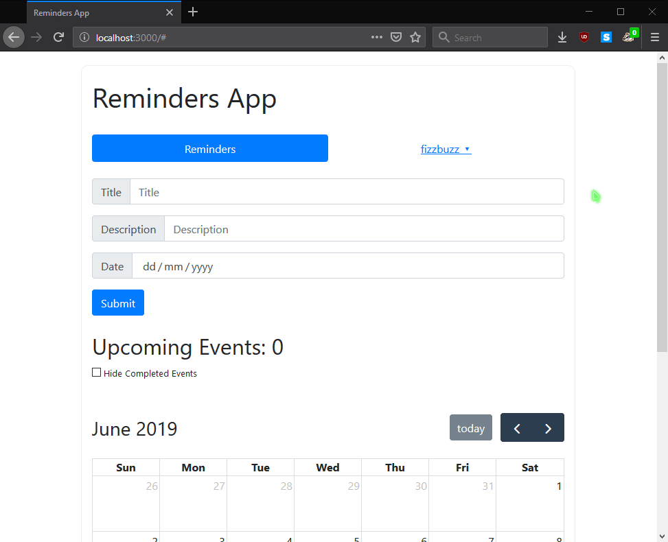
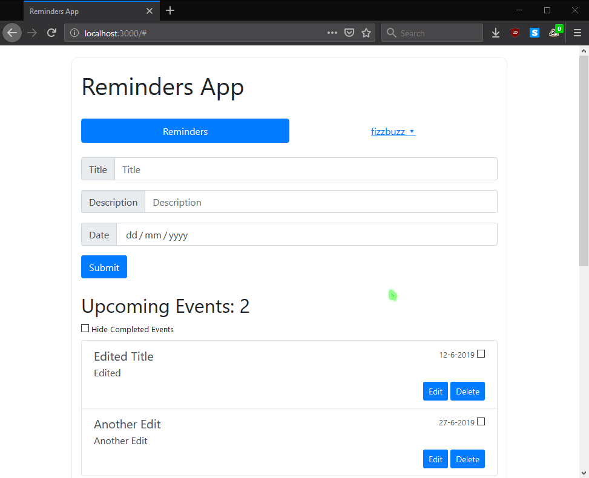

# Reminders App

## TODO
- [x] ~~Reminder Object: Title, Description, Date/Time~~ ✅
- [x] ~~MongoDB: Users & Reminders Collections~~ ✅
- [x] ~~User Authentication & Login~~ ✅
- [x] ~~User editing: add, delete, edit~~ ✅
- [x] ~~Collection modifcation via secure Meteor methods~~ ✅ 
- [x] ~~Design layout: LESS, Bootstrap~~ ✅
- [x] ~~Calendar integration (fullcalendar.io)~~ ✅
- [ ] Unit Tests ❌

## Build
```
cd <PROJECT_FOLDER>
meteor npm install --save @fullcalendar/core @fullcalendar/daygrid
meteor npm install --save bootstrap
meteor add less
meteor
```

## How To
### Login & Register


### Create new reminder


### Check & hide completed reminders


### Edit existing reminder


### Delete existing reminder
